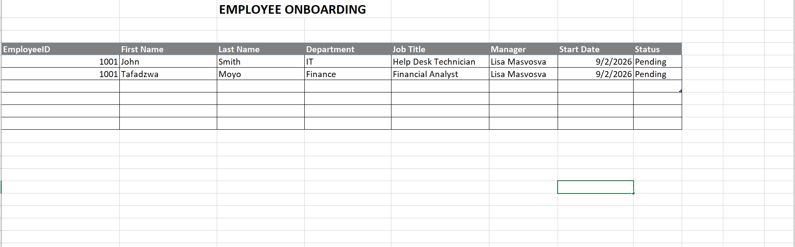

\# IAM Employee Onboarding Workflow


Hands-on Identity and Access Management lab using ServiceNow, Active Directory, PowerShell, and group-based access control.


\## Project Overview


This project simulates a new employee onboarding workflow from HR intake through IAM provisioning and verification.

</> Markdown

# IAM Employee Onboarding Workflow


## 1. HR Intake

The onboarding workflow begins with HR recording the new employee's
identity and employment information.

The employee in this scenario is Tafadzwa Moyo, a Financial Analyst
joining the Finance department.



</> Markdown

## 2. ServiceNow Onboarding Request
HR submitted a New Employee Onboarding request through the ServiceNow
Service Catalog.

The request included the employee's identity information, department,
job title, manager, requested access, and business justification.


</> Markdown

## 3. IAM fulfillment Task

A Catalog Task was created and assigned to the Identity & Access
Management team for fulfillment.

The IAM Analyst reviewed the request before provisioning access.


</> Markdown

## 4. Active Directory account creation

The employee account was created in the Finance organizational unit
using the approved identity information from the onboarding request.

Username: `tmoyo`


</> Markdown

## 5. Group-Based Access 

Standard Finance access was assigned through the `Finance-Users`
Active Directory security group.

No privileged administrative access was assigned.


## 6. Identity verification

PowerShell was used to verify the provisioned Active Directory account.

```powershell
Get-ADUser tmoyo -Properties EmployeeID,Department,Title,Enabled |
Select-Object SamAccountName,Name,EmployeeID,Department,Title,Enabled

```markdown

## 7. Ticket Closure

After provisioning and verification were completed, the IAM Analyst
documented the actions performed and moved the fulfillment task to
Closed Complete.


\## Technologies Used


\- ServiceNow PDI

\- Windows Server

\- Active Directory Domain Services

\- Windows 11

\- PowerShell

\- Excel

\- VirtualBox


\## Employee Scenario


The lab provisions a new Finance employee:


\- Name: Tafadzwa Moyo

\- Employee ID: 1002

\- Department: Finance

\- Job Title: Financial Analyst

\- AD Username: `tmoyo`

\- Security Group: `Finance-Users`

\- Privileged Access: None

