</> Markdown

# IAM Employee Onboarding Workflow

## Project Overview

This project simulates a real-world Identity and Access Management (IAM) employee onboarding workflow using ServiceNow and Microsoft Active Directory.

The lab follows a new employee from the initial HR onboarding record through access request submission, IAM review, Active Directory account creation, group-based access assignment, verification, documentation, and ticket closure.

The project was designed to demonstrate hands-on experience with identity lifecycle management and common IAM analyst responsibilities rather than simply creating user accounts manually.

## Workflow

HR Intake → ServiceNow Request → IAM Review → Active Directory Provisioning → Group-Based Access → PowerShell Verification → Ticket Closure

### Key IAM Concepts Demonstrated

- Identity lifecycle management (Joiner process)
- Active Directory user provisioning
- ServiceNow request and fulfillment workflows
- Role/group-based access assignment
- Principle of least privilege
- Separation of duties between HR and IAM
- Identity and access verification
- PowerShell administration
- IAM ticket documentation and audit trail

## Technologies Used

- ServiceNow PDI

- Windows Server

- Active Directory Domain Services

- Windows 11

- PowerShell

- Excel

- VirtualBox

## Employee Scenario

This lab simulates the onboarding of a new Finance employee:

- **Name:** Tafadzwa Moyo
- **Employee ID:** 1002
- **Department:** Finance
- **Job Title:** Financial Analyst
- **AD Username:** `tmoyo`
- **Security Group:** `Finance-Users`
- **Privileged Access:** None

ServiceNow records used during fulfillment:

- **Request:** `REQ0010004`
- **Requested Item:** `RITM0010004`
- **Catalog Task:** `SCTASK0010021`

---

## 1. HR Intake

The onboarding workflow begins with HR recording the new employee's
identity and employment information.

The employee in this scenario is Tafadzwa Moyo, a Financial Analyst
joining the Finance department.

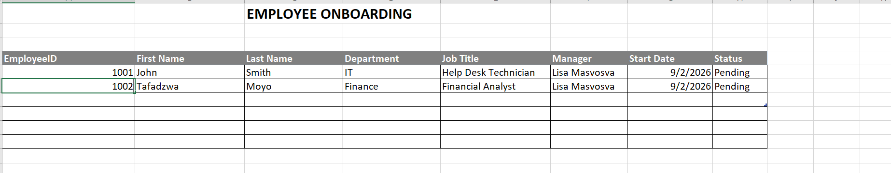


## 2. ServiceNow Onboarding Request
HR submitted a **New Employee Onboarding** request through the ServiceNow
Service Catalog.

The request included the employee's identity information, department,
job title, manager, requested access, and business justification.

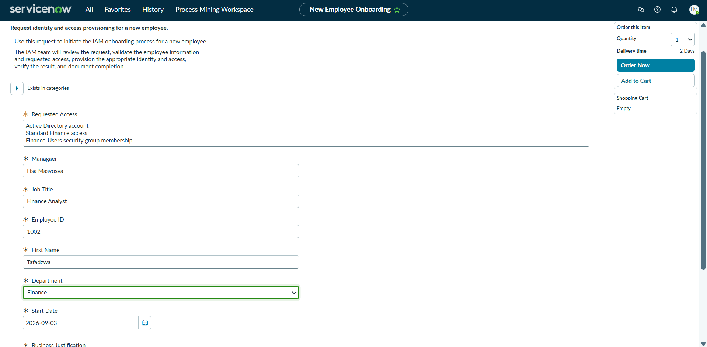

Submitting the request generated ServiceNow request `REQ0010004`.

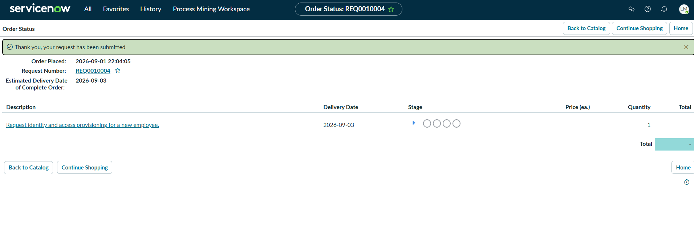


## 3. Requested Item Review

The onboarding request generated a Requested Item (RITM) containing the employee information and requested access.

The request was reviewed to ensure the employee information and requested Finance access were consistent with the onboarding record.

**RITM:** `RITM001004`

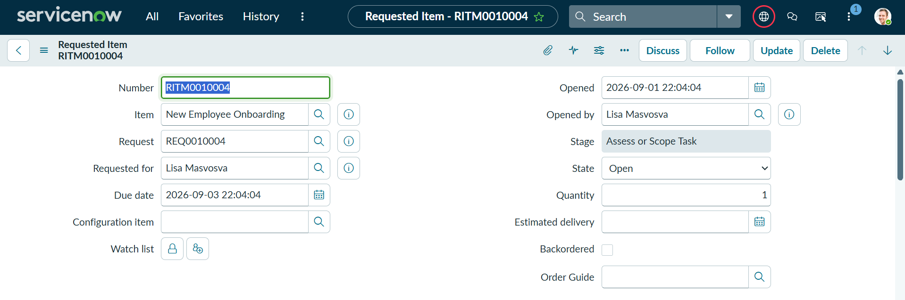

The request details provided the information required for IAM fulfillment.

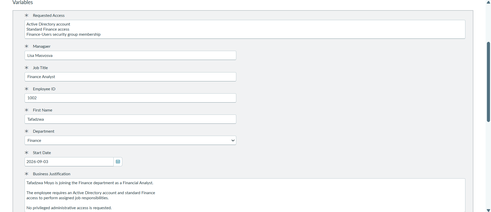

---

## 4. IAM Task Assignment and Validation

A ServiceNow Catalog Task was created for the Identity & Access Management team.

**Catalog Task:** `SCTASK0010021`

The task was assigned to the **Identity & Access Management** assignment group and an **IAM Analyst** for fulfillment.

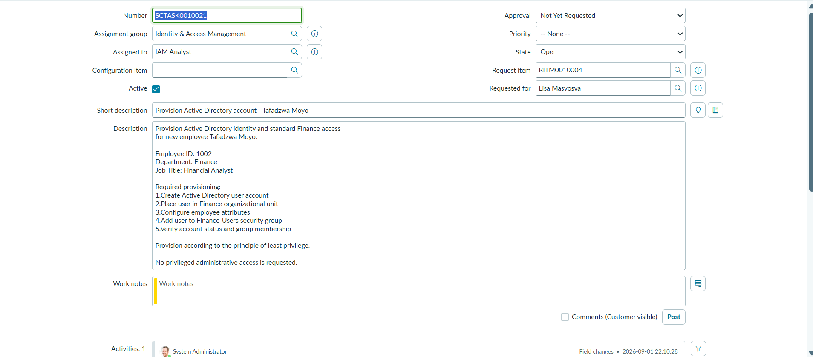

Before provisioning the account, the IAM Analyst reviewed the employee information and requested access.

The validation confirmed:

- Employee identity matched the onboarding request
- Department was Finance
- Job title was Financial Analyst
- Standard Finance access was requested
- `Finance-Users` membership was appropriate
- No privileged administrative access was requested

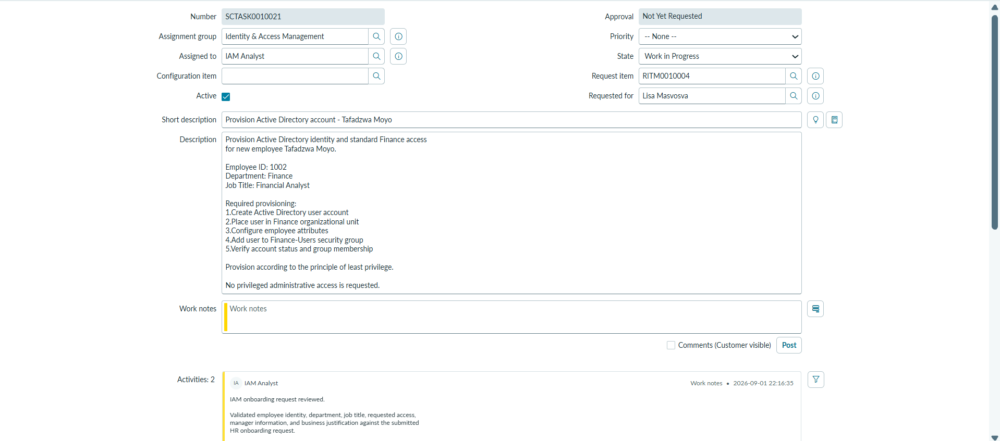

This follows the IAM process:

**Request → Validate → Provision → Verify → Document → Close**

---

## 5. Active Directory Provisioning

After validation, the employee's Active Directory account was created.

The account was provisioned with the username:

`tmoyo`

The identity was placed in the appropriate Finance organizational structure in Active Directory.

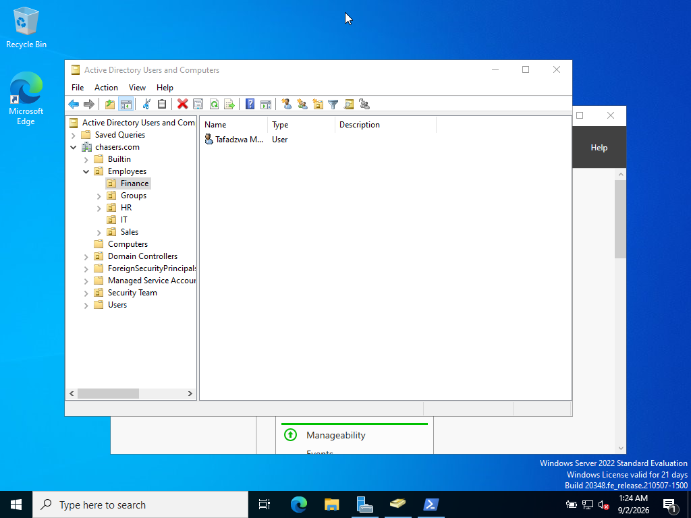

Employee attributes were configured to match the approved onboarding information, including department and job title.

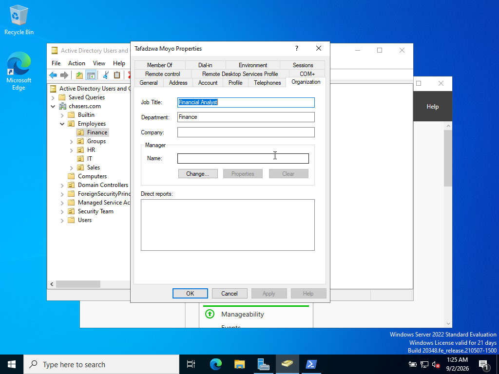

---

## 6. Group-Based Access Assignment

Standard Finance access was assigned using the Active Directory security group:

`Finance-Users`

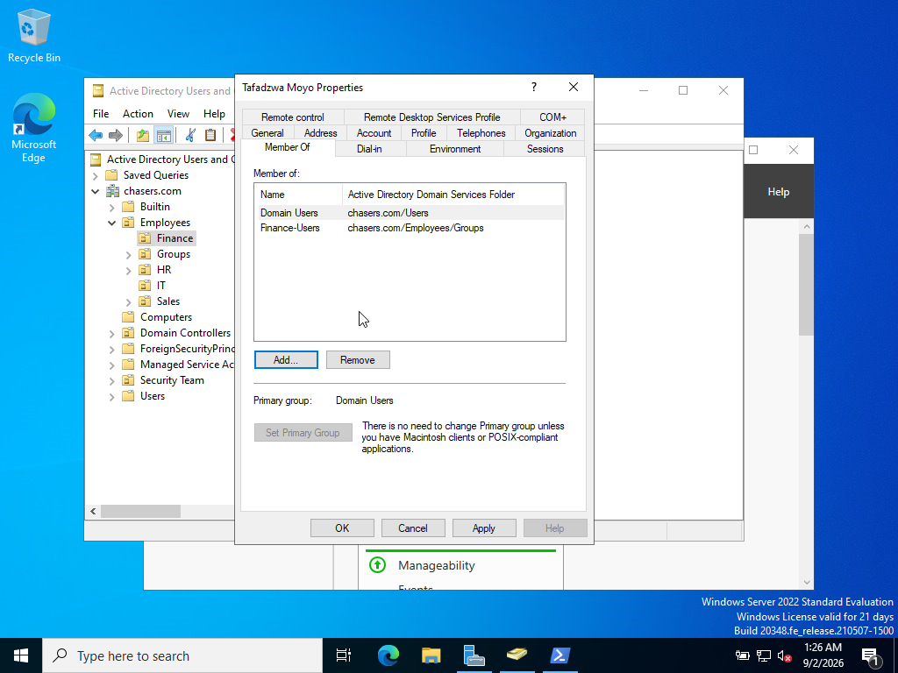

Using security groups instead of assigning permissions individually supports standardized access management and simplifies future access changes.

No privileged administrative groups were assigned to the employee, supporting the **principle of least privilege**.

---

## 7. PowerShell Verification

Provisioning was independently verified using PowerShell rather than relying only on the Active Directory graphical interface.

The following command was used to verify the employee account and identity attributes:

```powershell
Get-ADUser tmoyo -Properties EmployeeID,Department,Title,Enabled |
Select-Object SamAccountName,Name,EmployeeID,Department,Title,Enabled
```


Group membership was also verified:

```powershell
Get-ADPrincipalGroupMembership tmoyo |
Select-Object Name
```

The verification confirmed that the account received the expected standard Finance access.

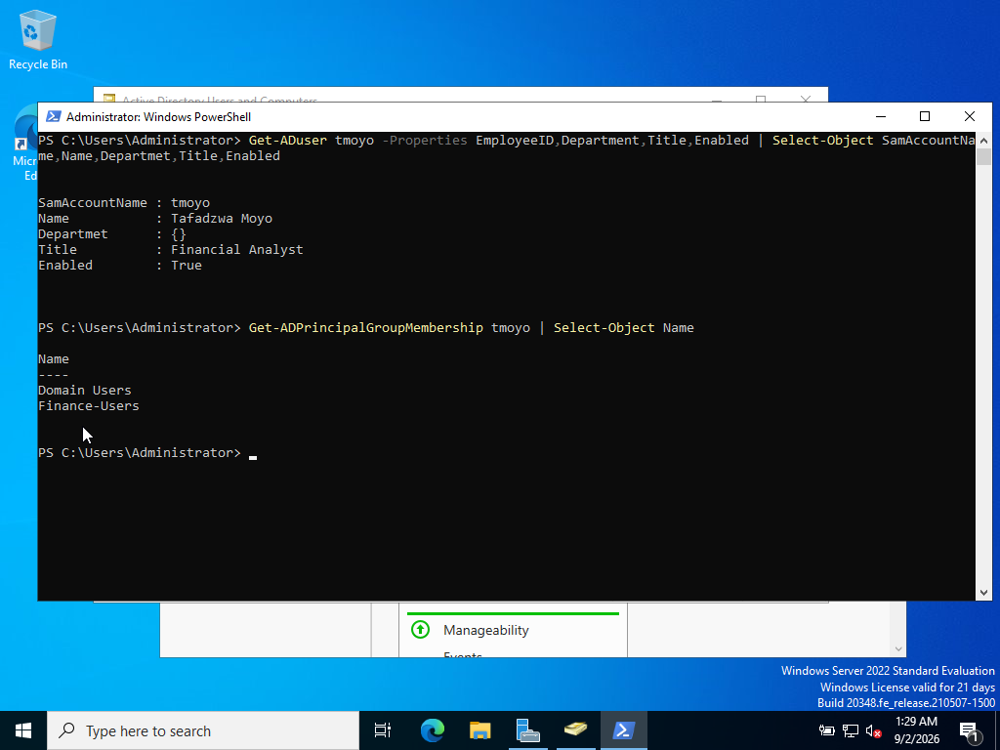

---

## 8. Domain Authentication Verification

The provisioned account was tested from the Windows 11 domain client to verify successful domain authentication.

The authenticated identity was checked using:

```cmd
whoami
```

This confirmed that the workstation recognized the employee as a domain user.


---

## 9. ServiceNow Fulfillment Documentation

After provisioning and verification were completed, the IAM Analyst returned to ServiceNow and documented the actions performed.

The fulfillment record documented:

- Active Directory account creation
- Finance OU placement
- Employee attribute configuration
- `Finance-Users` membership
- Account verification
- Group membership verification
- Confirmation that no privileged access was assigned

Passwords were not recorded in the ServiceNow ticket.

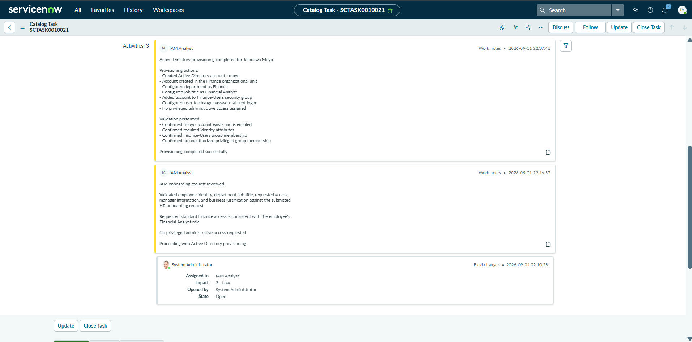

---

## 10. Ticket Closure

After successful provisioning and verification, Catalog Task `SCTASK0010021` was moved to **Closed Complete**.

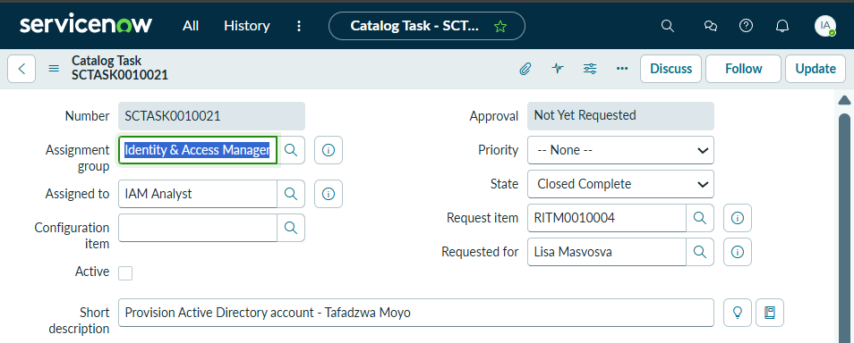

The parent Requested Item was reviewed to confirm completion of the IAM fulfillment activity.

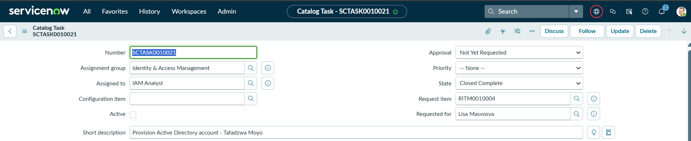

---

## Security Controls Demonstrated

| Security Control | Implementation |
|---|---|
| Least Privilege | Only standard Finance access was provisioned |
| Group-Based Access | Access assigned through `Finance-Users` |
| Separation of Duties | HR initiated the request while IAM performed provisioning |
| Identity Validation | Employee and access information reviewed before provisioning |
| Duplicate Account Prevention | Existing identity checked before account creation |
| Audit Trail | ServiceNow work notes documented fulfillment actions |
| Access Verification | PowerShell used to verify account and group membership |
| Password Security | Temporary credentials were not documented in tickets or GitHub |
| Identity Lifecycle Management | Onboarding followed a structured Joiner workflow |

---

## Project Outcome

The completed workflow demonstrated an end-to-end IAM onboarding process:

**HR Record → ServiceNow Request → IAM Validation → Active Directory Account → Group-Based Access → PowerShell Verification → Documentation → Closure**

The project demonstrates that IAM onboarding involves more than creating a user account. Identity data must be validated, access must be appropriate for the employee's business role, provisioning must follow least-privilege principles, and completed access should be verified and documented.

---

## Future Improvements

Potential extensions to this lab include:

- Automating Active Directory provisioning with PowerShell
- Building ServiceNow approval workflows
- Automating ServiceNow Catalog Task creation
- Adding Microsoft Entra ID
- Implementing MFA and Conditional Access
- Building employee transfer (Mover) workflows
- Building employee termination (Leaver) workflows
- Performing periodic access reviews
- Implementing role-based access control (RBAC)


